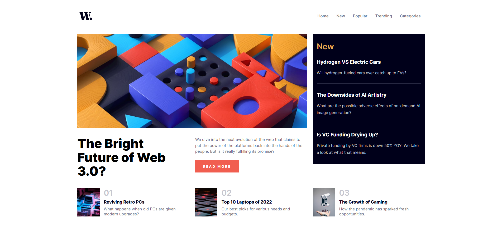
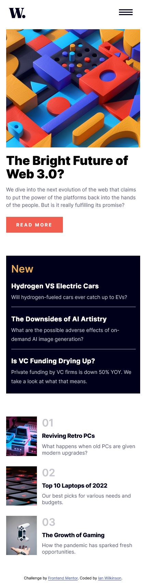

# Frontend Mentor - News homepage solution

This is a solution to the [News homepage challenge on Frontend Mentor](https://www.frontendmentor.io/challenges/news-homepage-H6SWTa1MFl). Frontend Mentor challenges help you improve your coding skills by building realistic projects. 

## Table of contents

- [Overview](#overview)
  - [The challenge](#the-challenge)
  - [Screenshot](#screenshot)
  - [Links](#links)
- [My process](#my-process)
  - [Built with](#built-with)
  - [What I learned](#what-i-learned)
  - [Continued development](#continued-development)
  - [Useful resources](#useful-resources)
- [Author](#author)


## Overview

### The challenge

Users should be able to:

- View the optimal layout for the interface depending on their device's screen size
- See hover and focus states for all interactive elements on the page

### Screenshot

Desktop:


Mobile: 



### Links

- [Live Site URL](https://news-homepage-ianwilk20.netlify.app/design/)

## My process

### Built with

- Semantic HTML5 markup
- CSS custom properties
- Flexbox
- CSS Grid
- Mobile-first workflow

### What I learned

- I learned how to create a responsive navigation bar using only HTML and CSS. The solution boiled down to a few parts: a media query, an HTML checkbox input and labels, and some styling. For the media query, anytime a screen of size less than 800px is detected it will show the mobile navigation bar. Otherwise, it will show the desktop navigation bar. For the HTML checkbox, we hide it from the display but have a label element (of a hamburger icon) that will be visible. When the hamburger icon is clicked, it will change the state of the checkbox to "checked" and that will cause the mobile navigation menu to transition in from the right side of the screen. When the close icon is clicked, it will remove the "checked" state from the checkbox and cause the mobile navigation menu to transition out of the right side of the screen.

- I learned about the general sibling selector in CSS and how it can be used to change the styles of elements that are next siblings of a specified element. This selector is especially helpful when you want the state of one element (ie. checkbox checked) to affect the styling of a sibling element, as opposed to using JS. 
Ex. When the checkbox is checked, the sibling with ```class="links-container"``` will have a horizontal positioning of 0 from the right.
```CSS
#nav-checkbox:checked ~ .links-container {
    right: 0;
}
```

- I learned how to use the CSS Grid Layout. The reference images for non-mobile screens looked like it would be a perfect candidate for grid since I could see three columns and three rows. I was able to break the page accordingly by specifying to the grid's template columns to create three columns with a size of 1fr:
```CSS
.page-body {
    display: grid;
    grid-template-columns: repeat(3, 1fr);
    gap: 1.5rem;
} 
```

### Continued development

It was great to finally learn and implment the very basics of the Grid layout for this challenge. There is still much to learn about this layout and that is something I will look into for future challenges.


### Useful resources

- [My first taste of a responsive navigation bar](https://youtu.be/SIzi9z8mrTk) - This helped me conceptually understand how to make a responsive navigation menu.
- [My second taste of a responsive navigation bar](https://www.youtube.com/watch?v=8eFeIFKAKHw) - This tutorial had a design most similar to the challenge so it was helpful to see what I could use of this in creating my navigation bar.
- [Learn CSS Grid](https://www.youtube.com/watch?v=rg7Fvvl3taU&t=1416s&pp=ygUIY3NzIGdyaWQ%3D) - This is an amazing YouTube video on the topic of the Grid layout and was very handy in this challenge.

## Author

- GitHub - [ianwilk20](https://github.com/ianwilk20)

